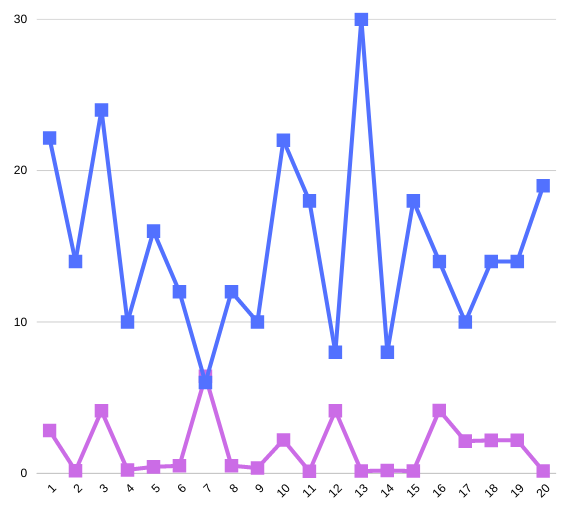

## 📘 Notes 📘

#### Todos os códigos de teste foram desenvolvidos em TypeScript utilizando o runtime Deno 🦕 e python 🐍

#### Neste README, você encontrará os resultados dos testes realizados. Para visualizar os resumos, basta clicar no tópico abaixo e seguir o link para a pasta onde o arquivo Resume.excalidraw está armazenado. Para abrir esse arquivo, basta acessar https://excalidraw.com/. 🎉

 ⚙️ Algorithms ⚙️ 

  
  

  

  
 Binary Research vs Linear Research 

   ### Average of 20 results
   
   - Binary = 1.7ms
   
   - Linear = 15.3ms
    
   
    
   Blue line for: Linear / Purple line for: Binary

  

